# Criterion B - Design

## UML Diagram for the Database:

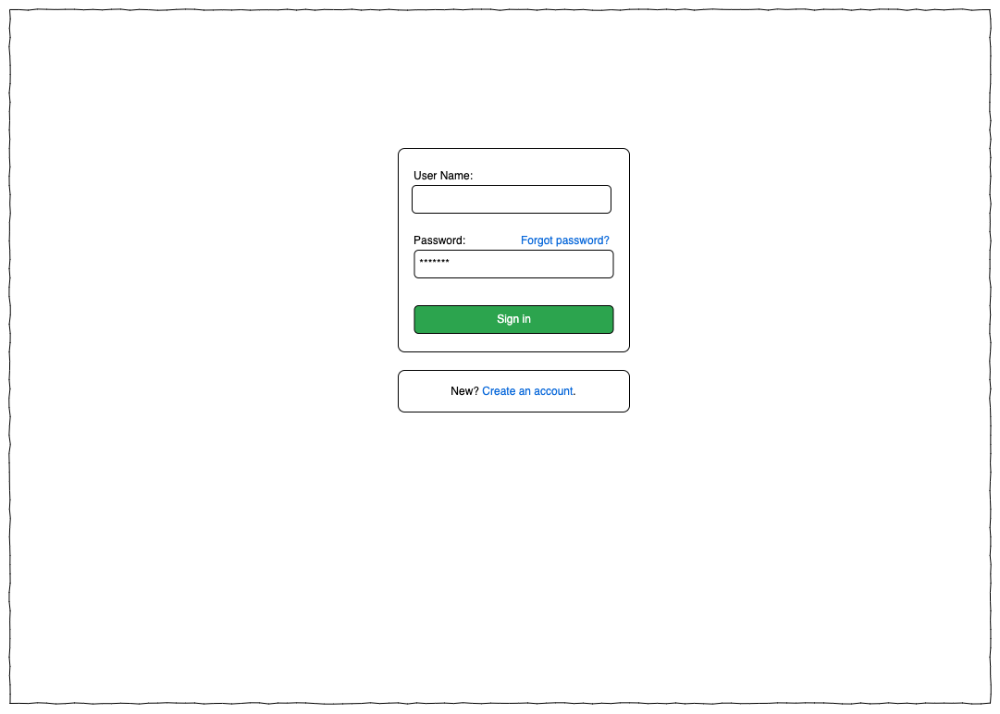

## UI Design:

For all screens, except “profile” and “submit record” (which will not be available), if the user is not signed in the “submit record” and “profile” buttons will be replaced with “sign in” and “sign up” as seen in the “signed out homepage” screen.

### Homepage (signed out):

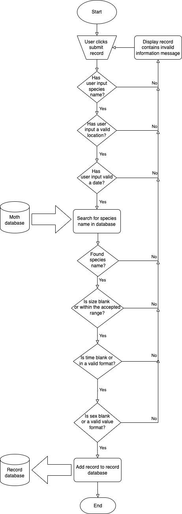

#### Homepage (signed in):

>>>>>  gd2md-html alert: inline image link here (to images/image3.png). Store image on your image server and adjust path/filename/extension if necessary.  (<a href="#">Back to top</a>)(<a href="#gdcalert4">Next alert</a>) >>>>> 

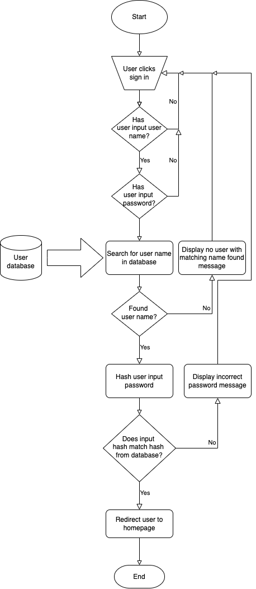

#### Sign in:

>>>>>  gd2md-html alert: inline image link here (to images/image4.png). Store image on your image server and adjust path/filename/extension if necessary.  (<a href="#">Back to top</a>)(<a href="#gdcalert5">Next alert</a>) >>>>> 

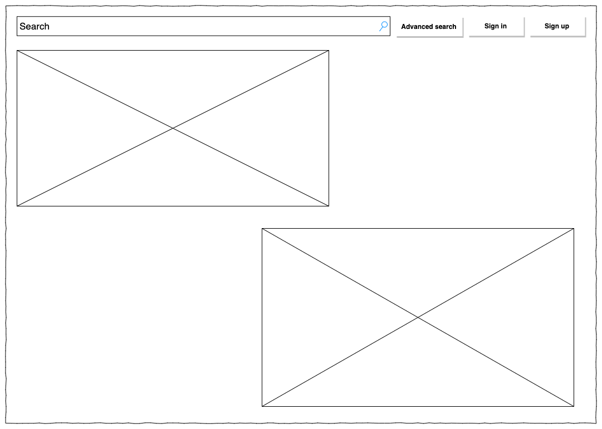

#### Sign up:

>>>>>  gd2md-html alert: inline image link here (to images/image5.png). Store image on your image server and adjust path/filename/extension if necessary.  (<a href="#">Back to top</a>)(<a href="#gdcalert6">Next alert</a>) >>>>> 

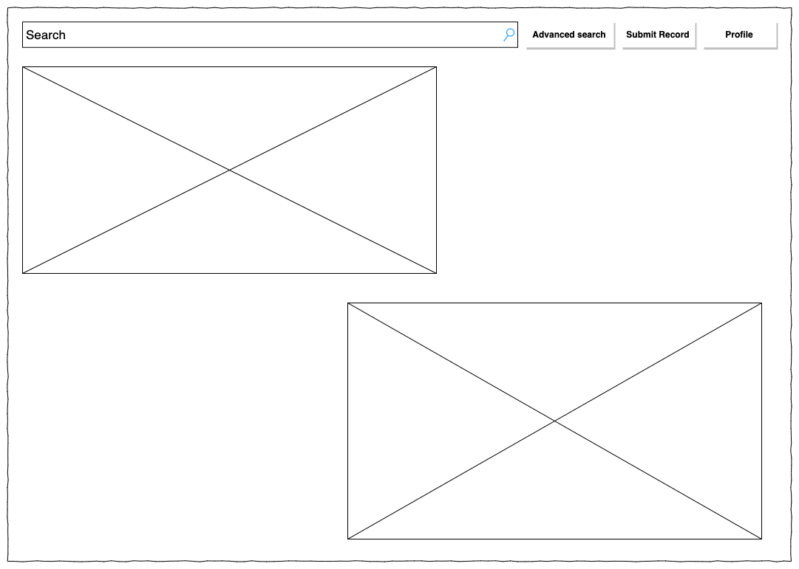

#### Advanced Search:

>>>>>  gd2md-html alert: inline image link here (to images/image6.png). Store image on your image server and adjust path/filename/extension if necessary.  (<a href="#">Back to top</a>)(<a href="#gdcalert7">Next alert</a>) >>>>> 

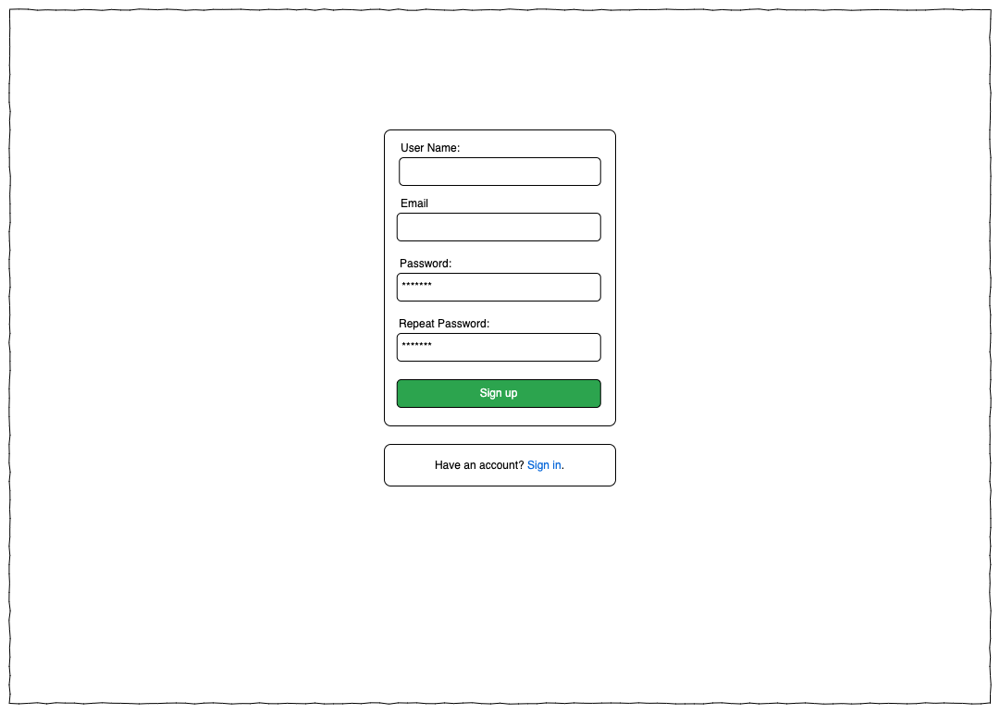

#### Moth Entry:

>>>>>  gd2md-html alert: inline image link here (to images/image7.png). Store image on your image server and adjust path/filename/extension if necessary.  (<a href="#">Back to top</a>)(<a href="#gdcalert8">Next alert</a>) >>>>> 

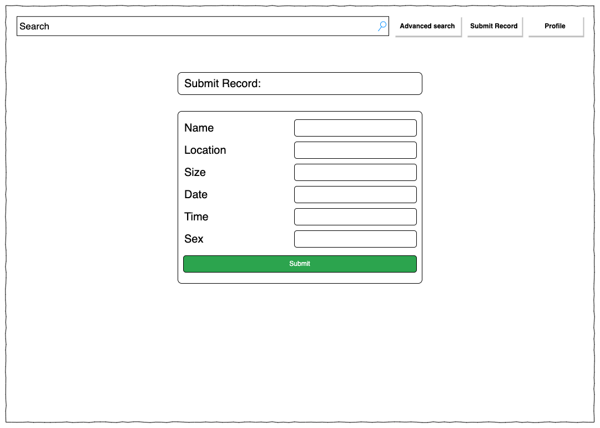

#### Records:

* When a record is clicked a box will appear showing extra information about that record

>>>>>  gd2md-html alert: inline image link here (to images/image8.png). Store image on your image server and adjust path/filename/extension if necessary.  (<a href="#">Back to top</a>)(<a href="#gdcalert9">Next alert</a>) >>>>> 

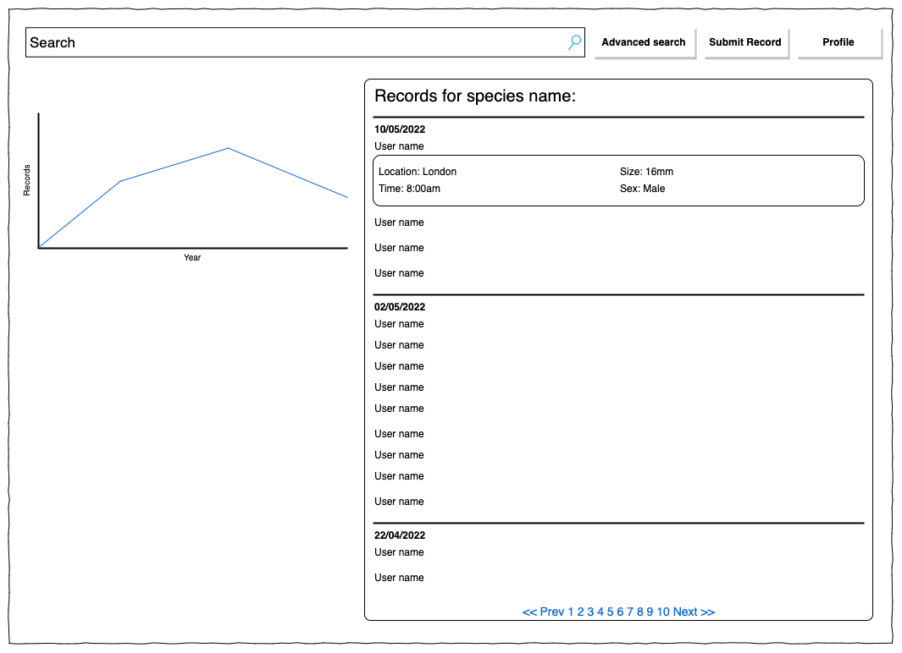

#### Submit Record:

* Some of this information (sex, size and time) will be optional

>>>>>  gd2md-html alert: inline image link here (to images/image9.png). Store image on your image server and adjust path/filename/extension if necessary.  (<a href="#">Back to top</a>)(<a href="#gdcalert10">Next alert</a>) >>>>> 

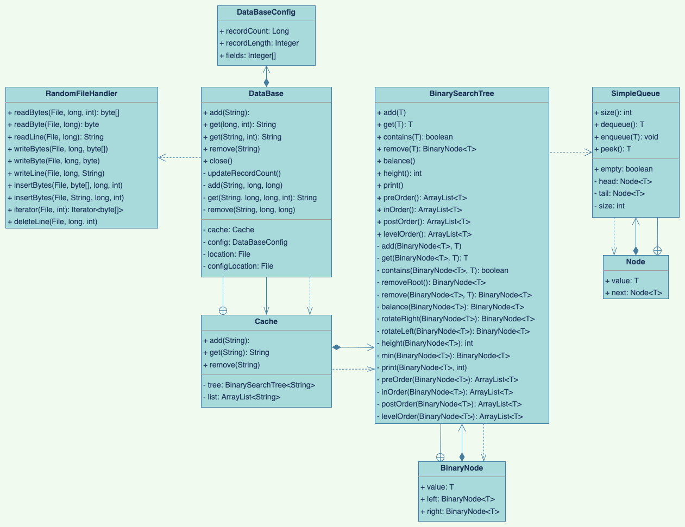

#### Profile:

* When a record is clicked a box will appear showing extra information about that record

>>>>>  gd2md-html alert: inline image link here (to images/image10.png). Store image on your image server and adjust path/filename/extension if necessary.  (<a href="#">Back to top</a>)(<a href="#gdcalert11">Next alert</a>) >>>>> 

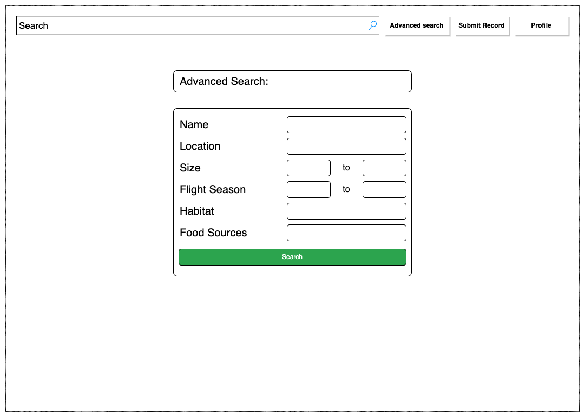

## Test Plan:

<table>
  <tr>
   <td><strong>Test Description</strong>
   </td>
   <td><strong>Nature of Test</strong>
   </td>
   <td><strong>Example</strong>
   </td>
  </tr>
  <tr>
   <td>Check that all menus are accessible when logged in
   </td>
   <td>Login to an account at check that all the menus are visible
   </td>
   <td>Login and view the “profile” menu
   </td>
  </tr>
  <tr>
   <td>Check that non logged in users are not be able to submit records
   </td>
   <td>Users who are not logged in should be unable to submit records
   </td>
   <td>Attempt to submit a record when not logged in
   </td>
  </tr>
  <tr>
   <td>Check that users can submit and view records
   </td>
   <td>Attempt to submit and view a record
   </td>
   <td>Submit a record and check if it appears in the users profile
   </td>
  </tr>
  <tr>
   <td>Every users email should be unique
   </td>
   <td>If a users attempts to create an account with an email that is already in use notify them
   </td>
   <td>Create one account with an email and try to create another with the same email
   </td>
  </tr>
  <tr>
   <td>Check that the submit record function only submits valid records
   </td>
   <td>Users should be unable to submit a record with an invalid species name
   </td>
   <td>Attempt to submit a record with a invalid species name such as “invalid”
   </td>
  </tr>
  <tr>
   <td>Check that moderator users can remove records
   </td>
   <td>Moderator users should be able to review and remove records
   </td>
   <td>Login to a moderator account and try and remove a record created by another user
   </td>
  </tr>
  <tr>
   <td>Check that the records are searchable
   </td>
   <td>Users should be able to search for a species or search using other characteristics
   </td>
   <td>Attempt to search using a species name and using alternative characteristics
   </td>
  </tr>
</table>

## Flowcharts:

#### Submit Record:

>>>>>  gd2md-html alert: inline image link here (to images/image11.png). Store image on your image server and adjust path/filename/extension if necessary.  (<a href="#">Back to top</a>)(<a href="#gdcalert12">Next alert</a>) >>>>> 

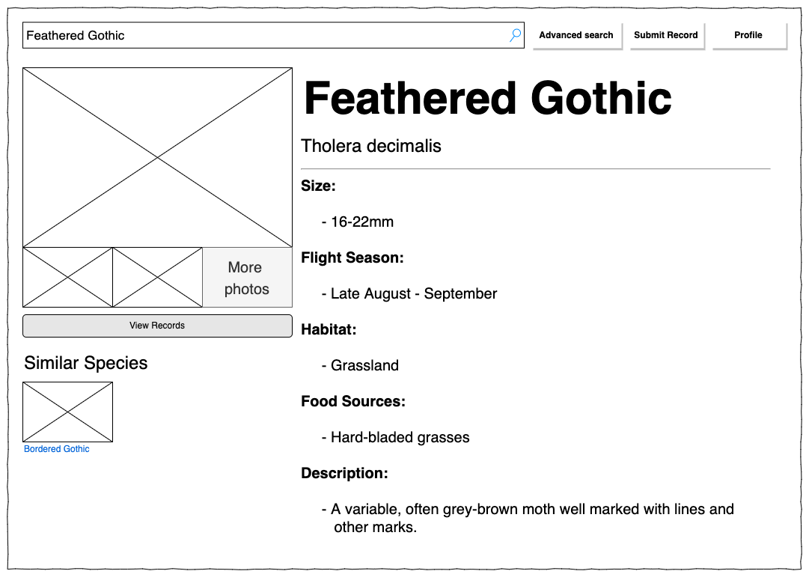

#### Login:

>>>>>  gd2md-html alert: inline image link here (to images/image12.png). Store image on your image server and adjust path/filename/extension if necessary.  (<a href="#">Back to top</a>)(<a href="#gdcalert13">Next alert</a>) >>>>> 

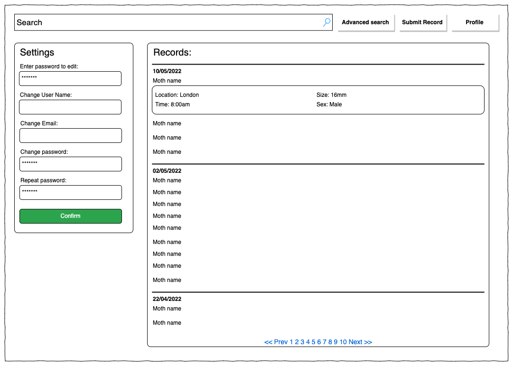

## Record of Tasks:

<table>
  <tr>
   <td><strong>Task number</strong>
   </td>
   <td><strong>Planned action </strong>
   </td>
   <td><strong>Planned outcome</strong>
   </td>
   <td><strong>Time estimate</strong>
   </td>
   <td><strong>Target completion date</strong>
   </td>
   <td><strong>Criterion</strong>
   </td>
  </tr>
  <tr>
   <td><strong>1</strong>
   </td>
   <td><strong>Think about potential IA ideas</strong>
   </td>
   <td><strong>Select several possible projects</strong>
   </td>
   <td><strong>1 week</strong>
   </td>
   <td><strong>31th October 2021</strong>
   </td>
   <td><strong>A</strong>
   </td>
  </tr>
  <tr>
   <td><strong>2</strong>
   </td>
   <td><strong>Select the best IA project and contact client</strong>
   </td>
   <td><strong>Choose a possible project and pitch it to receive feedback</strong>
   </td>
   <td><strong>1 week</strong>
   </td>
   <td><strong>10th November 2021</strong>
   </td>
   <td><strong>A</strong>
   </td>
  </tr>
  <tr>
   <td><strong>3</strong>
   </td>
   <td><strong>Pitch the selected project</strong>
   </td>
   <td><strong>Pitch a project and receive feedback</strong>
   </td>
   <td><strong>1 day</strong>
   </td>
   <td><strong>15th November 2021</strong>
   </td>
   <td><strong>A</strong>
   </td>
  </tr>
  <tr>
   <td><strong>4</strong>
   </td>
   <td><strong>Consult client for further details</strong>
   </td>
   <td><strong>Better understand the clients requirements</strong>
   </td>
   <td><strong>1 day</strong>
   </td>
   <td><strong>25th November 2021</strong>
   </td>
   <td><strong>A</strong>
   </td>
  </tr>
  <tr>
   <td><strong>5</strong>
   </td>
   <td><strong>Plan project UI</strong>
   </td>
   <td><strong>Create wireframes for the projects different screens</strong>
   </td>
   <td><strong>1 week</strong>
   </td>
   <td><strong>1st January 2022</strong>
   </td>
   <td><strong>B</strong>
   </td>
  </tr>
  <tr>
   <td><strong>6</strong>
   </td>
   <td><strong>Plan and begin work on file access</strong>
   </td>
   <td><strong>Have a better understanding on what files will be needed and how the information will be stored</strong>
   </td>
   <td><strong>1 week</strong>
   </td>
   <td><strong>10th January 2022</strong>
   </td>
   <td><strong>C</strong>
   </td>
  </tr>
  <tr>
   <td><strong>7</strong>
   </td>
   <td><strong>Create database implementation</strong>
   </td>
   <td><strong>Create a fully functioning database system in java to be used to store moth records and user details</strong>
   </td>
   <td><strong>2 weeks</strong>
   </td>
   <td><strong>22nd February 2022</strong>
   </td>
   <td><strong>C</strong>
   </td>
  </tr>
  <tr>
   <td><strong>8</strong>
   </td>
   <td><strong>Research password hashing methods</strong>
   </td>
   <td><strong>Understand how to hash passwords to securely store them in a database</strong>
   </td>
   <td><strong>1 week</strong>
   </td>
   <td><strong>17th March 2022</strong>
   </td>
   <td><strong>C</strong>
   </td>
  </tr>
  <tr>
   <td><strong>9</strong>
   </td>
   <td><strong>In person meeting with client</strong>
   </td>
   <td><strong>Further develop and clarify success criteria and receive feedback on UI plan</strong>
   </td>
   <td><strong>1 day</strong>
   </td>
   <td><strong>4th April 2022</strong>
   </td>
   <td><strong>A</strong>
   </td>
  </tr>
</table>

